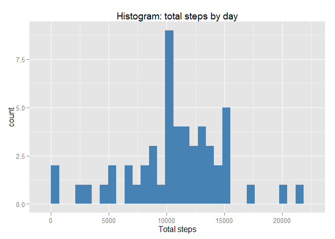
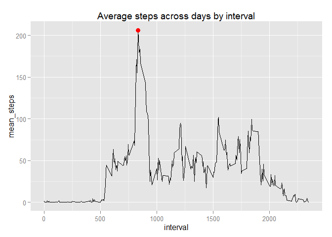

# Reproducible Research: Peer Assessment 1
------------------------------------------


Author:  C. Deramond  
Course:  *repdata-008* 


## Loading and preprocessing the data

For this assignment, we initially load packages, data and make initial transformations:

```r
library(ggplot2, quietly = T, warn.conflicts = F)
library(lubridate, quietly = T, warn.conflicts = F)
library(dplyr, quietly = T, warn.conflicts = F)
library(data.table, quietly = T, warn.conflicts = F)

data <- read.csv("activity.csv", stringsAsFactors=FALSE) #get the data
data$date <- ymd(data$date) # date parsing              
```


## What is mean total number of steps taken per day?

let's examine code to generate response first:


```r
#summary table
data_hist <- as.tbl(data) %>%
        filter(!is.na(steps)) %>%
        group_by(date) %>%
        summarise(n = n(), total = sum(steps), 
                  mean = mean(steps), 
                  median = median(total)) 
data_hist$median <- median(data_hist$total) #as sugested by TA
```

1. **histogram:**


```r
hist <- ggplot(data_hist)
hist + aes(total)  + 
        geom_histogram(fill="steelblue") + 
        ggtitle("Histogram: total steps by day") + 
        labs(x = "Total steps")
```

```
## stat_bin: binwidth defaulted to range/30. Use 'binwidth = x' to adjust this.
```

 

2. **summary table:** 


```
## Source: local data frame [53 x 5]
## 
##          date   n total       mean median
## 1  2012-10-02 288   126  0.4375000  10765
## 2  2012-10-03 288 11352 39.4166667  10765
## 3  2012-10-04 288 12116 42.0694444  10765
## 4  2012-10-05 288 13294 46.1597222  10765
## 5  2012-10-06 288 15420 53.5416667  10765
## 6  2012-10-07 288 11015 38.2465278  10765
## 7  2012-10-09 288 12811 44.4826389  10765
## 8  2012-10-10 288  9900 34.3750000  10765
## 9  2012-10-11 288 10304 35.7777778  10765
## 10 2012-10-12 288 17382 60.3541667  10765
## 11 2012-10-13 288 12426 43.1458333  10765
## 12 2012-10-14 288 15098 52.4236111  10765
## 13 2012-10-15 288 10139 35.2048611  10765
## 14 2012-10-16 288 15084 52.3750000  10765
## 15 2012-10-17 288 13452 46.7083333  10765
## 16 2012-10-18 288 10056 34.9166667  10765
## 17 2012-10-19 288 11829 41.0729167  10765
## 18 2012-10-20 288 10395 36.0937500  10765
## 19 2012-10-21 288  8821 30.6284722  10765
## 20 2012-10-22 288 13460 46.7361111  10765
## 21 2012-10-23 288  8918 30.9652778  10765
## 22 2012-10-24 288  8355 29.0104167  10765
## 23 2012-10-25 288  2492  8.6527778  10765
## 24 2012-10-26 288  6778 23.5347222  10765
## 25 2012-10-27 288 10119 35.1354167  10765
## 26 2012-10-28 288 11458 39.7847222  10765
## 27 2012-10-29 288  5018 17.4236111  10765
## 28 2012-10-30 288  9819 34.0937500  10765
## 29 2012-10-31 288 15414 53.5208333  10765
## 30 2012-11-02 288 10600 36.8055556  10765
## 31 2012-11-03 288 10571 36.7048611  10765
## 32 2012-11-05 288 10439 36.2465278  10765
## 33 2012-11-06 288  8334 28.9375000  10765
## 34 2012-11-07 288 12883 44.7326389  10765
## 35 2012-11-08 288  3219 11.1770833  10765
## 36 2012-11-11 288 12608 43.7777778  10765
## 37 2012-11-12 288 10765 37.3784722  10765
## 38 2012-11-13 288  7336 25.4722222  10765
## 39 2012-11-15 288    41  0.1423611  10765
## 40 2012-11-16 288  5441 18.8923611  10765
## 41 2012-11-17 288 14339 49.7881944  10765
## 42 2012-11-18 288 15110 52.4652778  10765
## 43 2012-11-19 288  8841 30.6979167  10765
## 44 2012-11-20 288  4472 15.5277778  10765
## 45 2012-11-21 288 12787 44.3993056  10765
## 46 2012-11-22 288 20427 70.9270833  10765
## 47 2012-11-23 288 21194 73.5902778  10765
## 48 2012-11-24 288 14478 50.2708333  10765
## 49 2012-11-25 288 11834 41.0902778  10765
## 50 2012-11-26 288 11162 38.7569444  10765
## 51 2012-11-27 288 13646 47.3819444  10765
## 52 2012-11-28 288 10183 35.3576389  10765
## 53 2012-11-29 288  7047 24.4687500  10765
```


## What is the average daily activity pattern?

1. Make a time series plot (i.e. type = "l") of the 5-minute interval (x-axis) and the average number of steps taken, averaged across all days (y-axis)


```r
data_ts <- as.data.table(data)
data_ts <- data_ts[!is.na(steps) , list(n = .N, 
                                        total_steps = sum(steps), 
                                        mean_steps = mean(steps)) , 
                   by = interval] # subset and summary variables

ts <- ggplot(data = data_ts, aes(interval, mean_steps))
# Graph the TS plus a red point with the max
ts + geom_line() + 
        geom_point(data = data_ts[max(mean_steps) == mean_steps,] , size = 3, col = "red") +
        ggtitle("Average steps across days by interval")
```

 


2. Which 5-minute interval, on average across all the days in the dataset, contains the maximum number of steps?

this is fairly straight as shown in the graph with values:

- Interval = **835**

- Average steps = **53**


or, as shown in the table below:

```r
data_ts[max(mean_steps) == mean_steps,]
```

```
##    interval  n total_steps mean_steps
## 1:      835 53       10927   206.1698
```


## Imputing missing values

1. Calculate and report the total number of missing values in the dataset (i.e. the total number of rows with NAs)

the number of of NA's is 2304, as by `sum(is.na(data$steps))`


2. Devise a strategy for filling in all of the missing values in the dataset. The strategy does not need to be sophisticated. For example, you could use the mean/median for that day, or the mean for that 5-minute interval, etc.

We'll use the sample mean for that specific interval. Then we validate by checking number of NA's


```r
data <- as.data.table(data)
DataFixed <- left_join(data[is.na(steps),], 
                       select(data_ts, interval, steps = total_steps), 
                       by = "interval") %>%
        select(steps = steps.y, 3, 1) %>%
        arrange(date, interval)
# we validate approach by checking number of na in this new set
colSums(is.na(DataFixed))
```

```
##    steps     date interval 
##        0        0        0
```


3. Create a new dataset that is equal to the original dataset but with the missing data filled in.

As the dataset is already created, now we merge:


```r
dataMerge <- rbind_all(list(DataFixed, data[!is.na(steps),])) %>%
        mutate(date = ymd(date)) %>%
        arrange(date, interval)   # re-parse date and arrange by date, interval
        print(dataMerge)
```

```
## Source: local data frame [17,568 x 3]
## 
##    steps       date interval
## 1     91 2012-10-01        0
## 2     18 2012-10-01        5
## 3      7 2012-10-01       10
## 4      8 2012-10-01       15
## 5      4 2012-10-01       20
## 6    111 2012-10-01       25
## 7     28 2012-10-01       30
## 8     46 2012-10-01       35
## 9      0 2012-10-01       40
## 10    78 2012-10-01       45
## ..   ...        ...      ...
```

4. Make a histogram of the total number of steps taken each day and Calculate and report the mean and median total number of steps taken per day. Do these values differ from the estimates from the first part of the assignment? What is the impact of imputing missing data on the estimates of the total daily number of steps?


## Are there differences in activity patterns between weekdays and weekends?

1 .Create a new factor variable in the dataset with two levels - "weekday" and "weekend" indicating whether a given date is a weekday or weekend day.


2. Make a panel plot containing a time series plot (i.e. type = "l") of the 5-minute interval (x-axis) and the average number of steps taken, averaged across all weekday days or weekend days (y-axis). See the README file in the GitHub repository to see an example of what this plot should look like using simulated data.
