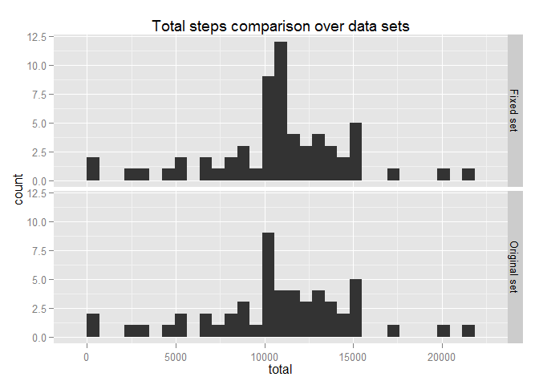
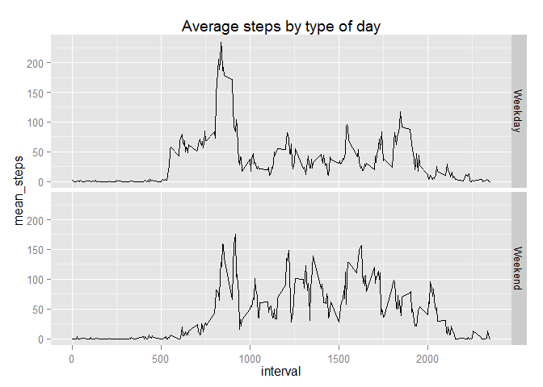

# Reproducible Research: Peer Assessment 1
------------------------------------------


Author:  C. Deramond  
Course:  *repdata-008* 


## Loading and preprocessing the data

For this assignment, we initially load packages, data and make initial transformations:

```r
library(ggplot2, quietly = T, warn.conflicts = F)
library(lubridate, quietly = T, warn.conflicts = F)
library(dplyr, quietly = T, warn.conflicts = F)
library(data.table, quietly = T, warn.conflicts = F)

data <- read.csv("activity.csv", stringsAsFactors=FALSE) #get the data
data$date <- ymd(data$date) # date parsing              
```


## What is mean total number of steps taken per day?

let's examine code to generate response first:


```r
#summary table
data_hist <- as.tbl(data) %>%
        filter(!is.na(steps)) %>%
        group_by(date) %>%
        summarise(n = n(), total = sum(steps), 
                  mean = mean(steps), 
                  median = median(total)) 
data_hist$median <- median(data_hist$total) #as sugested by TA
```

1. **histogram:**


```r
hist <- ggplot(data_hist)
hist + aes(total)  + 
        geom_histogram(fill="steelblue") + 
        ggtitle("Histogram: total steps by day") + 
        labs(x = "Total steps")
```

```
## stat_bin: binwidth defaulted to range/30. Use 'binwidth = x' to adjust this.
```

 

2. **summary table:** 


```
##                   Median_Total
## Mean_Total         10765
##   37.3825995807128     1
```


## What is the average daily activity pattern?

1. Make a time series plot (i.e. type = "l") of the 5-minute interval (x-axis) and the average number of steps taken, averaged across all days (y-axis)


```r
data_ts <- as.data.table(data)
data_ts <- data_ts[!is.na(steps) , list(n = .N, 
                                        total_steps = sum(steps), 
                                        mean_steps = mean(steps)) , 
                   by = interval] # subset and summary variables

ts <- ggplot(data = data_ts, aes(interval, mean_steps))
# Graph the TS plus a red point with the max
ts + geom_line() + 
        geom_point(data = data_ts[max(mean_steps) == mean_steps,] , size = 3, col = "red") +
        ggtitle("Average steps across days by interval")
```

 


2. Which 5-minute interval, on average across all the days in the dataset, contains the maximum number of steps?

this is fairly straight as shown in the graph with values:

- Interval = **835**

- Average steps = **53**


or, as shown in the table below:

```r
data_ts[max(mean_steps) == mean_steps,]
```

```
##    interval  n total_steps mean_steps
## 1:      835 53       10927   206.1698
```


## Imputing missing values

1. Calculate and report the total number of missing values in the dataset (i.e. the total number of rows with NAs)

the number of of NA's is 2304, as by `sum(is.na(data$steps))`


2. Devise a strategy for filling in all of the missing values in the dataset. The strategy does not need to be sophisticated. For example, you could use the mean/median for that day, or the mean for that 5-minute interval, etc.

We'll use the sample mean for that specific interval. Then we validate by checking number of NA's


```r
data <- as.data.table(data)
DataFixed <- left_join(data[is.na(steps),], 
                       select(data_ts, interval, steps = mean_steps), 
                       by = "interval") %>%
        select(steps = steps.y, 3, 1) %>%
        arrange(date, interval)
# we validate approach by checking number of na in this new set
colSums(is.na(DataFixed))
```

```
##    steps     date interval 
##        0        0        0
```


3. Create a new dataset that is equal to the original dataset but with the missing data filled in.

As the dataset is already created, now we merge:


```r
dataMerge <- rbind_all(list(DataFixed, data[!is.na(steps),])) %>%
        mutate(date = ymd(date)) %>%
        arrange(date, interval)   # re-parse date and arrange by date, interval
        print(dataMerge)
```

```
## Source: local data frame [17,568 x 3]
## 
##        steps       date interval
## 1  1.7169811 2012-10-01        0
## 2  0.3396226 2012-10-01        5
## 3  0.1320755 2012-10-01       10
## 4  0.1509434 2012-10-01       15
## 5  0.0754717 2012-10-01       20
## 6  2.0943396 2012-10-01       25
## 7  0.5283019 2012-10-01       30
## 8  0.8679245 2012-10-01       35
## 9  0.0000000 2012-10-01       40
## 10 1.4716981 2012-10-01       45
## ..       ...        ...      ...
```

4. Make a histogram of the total number of steps taken each day and Calculate and report the mean and median total number of steps taken per day. Do these values differ from the estimates from the first part of the assignment? What is the impact of imputing missing data on the estimates of the total daily number of steps?

As could be expected adding the mean on the NA's has centered the data.


```r
dataMerge$setID <- "Fixed set"
data$setID <- "Original set"

dataComplete <- rbind_all(list(dataMerge, data)) %>%
        mutate(date = ymd(date), setID = as.factor(setID)) %>%
        arrange(setID, date, interval)
# now on to the histogram
hist_complete <- dataComplete %>%
        filter(!is.na(steps)) %>%
        group_by( date, setID) %>%
        summarise(n = n(), 
                  total = sum(steps), 
                  mean = mean(steps), 
                  median = median(total)) %>%
        arrange(date, setID)
qplot(total, data = hist_complete, 
      facets = setID ~., 
      main = "Total steps comparison over data sets")
```

```
## stat_bin: binwidth defaulted to range/30. Use 'binwidth = x' to adjust this.
## stat_bin: binwidth defaulted to range/30. Use 'binwidth = x' to adjust this.
```

 

Moreover, if we compare the mean total and median, we see very insifgnificant change, thus suggesting our imputation is not effective.


```r
data.table(hist_complete)[, list("Mean total" = mean(mean), 
                                 "Median total" = median(total)), 
                          by = setID] # recalculation, coherent with initial section
```

```
##           setID Mean total Median total
## 1:    Fixed set    37.3826     10766.19
## 2: Original set    37.3826     10765.00
```


## Are there differences in activity patterns between weekdays and weekends?

1 .Create a new factor variable in the dataset with two levels - "weekday" and "weekend" indicating whether a given date is a weekday or weekend day.


```r
data <- mutate(data, dayType = factor(ifelse(wday(date) %in% 2:6, "Weekday", "Weekend")))
```


2. Make a panel plot containing a time series plot (i.e. type = "l") of the 5-minute interval (x-axis) and the average number of steps taken, averaged across all weekday days or weekend days (y-axis). See the README file in the GitHub repository to see an example of what this plot should look like using simulated data.


```r
data_ts2 <- data.table(data)
data_ts2 <- data_ts2[!is.na(steps) , list(n = .N, 
                                        total_steps = sum(steps), 
                                        mean_steps = mean(steps)) , 
                   by = list(dayType, interval)] # subset and summary variables
# graph
ts2 <- ggplot(data = data_ts2, aes(interval, mean_steps))
ts2 + geom_line() + facet_grid(dayType ~.) + ggtitle("Average steps by type of day")
```

 


